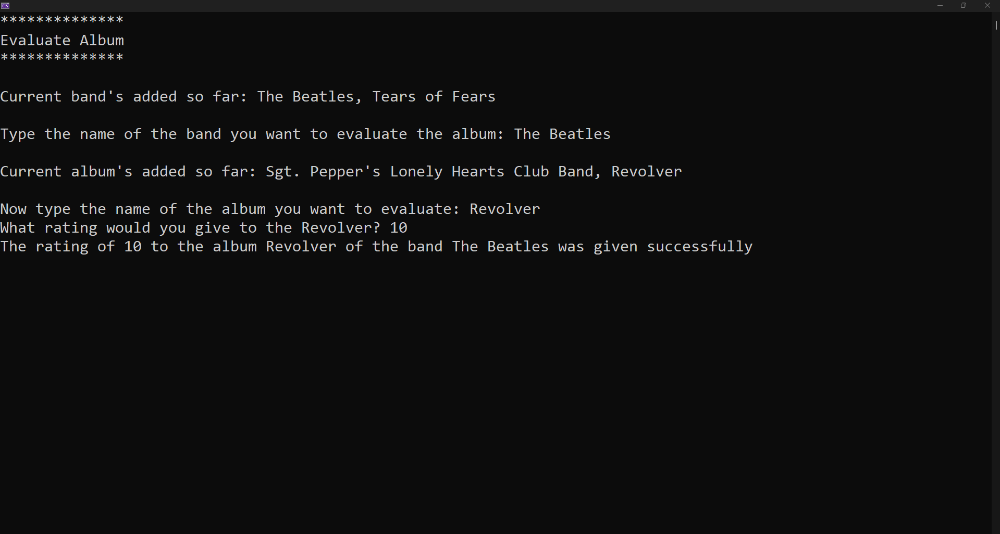

<h1 align="center">Class Sound</h1>

Class Sound is a console application developed in C# for study purposes. The application allows users to interact with a menu of options to register bands, albums, rate bands and albums, display all registered bands, and details of a specific band.

  
  &nbsp; &nbsp; &nbsp; &nbsp;
  
  &nbsp; &nbsp; &nbsp; &nbsp;
  

<h2>Technologies and Best Practices</h2>

The application was developed using various technologies and best practices, including:

<ul>
    <li><strong>C#</strong>: The application was entirely written in C#, a modern, object-oriented, and strongly typed programming language.</li>
    <li><strong>Singleton Pattern</strong>: The Singleton pattern was used to ensure that only one instance of MenuShowOptions exists throughout the application.</li>
    <li><strong>Async/Await</strong>: The application makes extensive use of asynchronous operations to ensure that the user interface remains responsive, even during long-running operations.</li>
    <li><strong>Exception Handling</strong>: The application includes robust exception handling to ensure that errors are properly caught and handled.</li>
</ul>

<h2>Integration with ChatGPT</h2>

The application also integrates with ChatGPT, an AI language model from OpenAI. The ChatGpt class in the application uses the OpenAI API to interact with ChatGPT. The application sends a prompt to ChatGPT and receives a response, which is then returned to the user. This integration allows the application to provide informal resumes of bands in a paragraph.

Please note that to use the ChatGPT integration, you will need to provide your own OpenAI API key.

<h2>How to Use</h2>

To use the application, simply run the program and follow the instructions in the options menu. You can type the number corresponding to the option you want to select and press Enter. To exit the application, type -1.

Please note that this is a study application and should not be used in a production environment.
